# RIKMS Metadata Lab

RIKMS Metadata Lab is a private, local-first workspace for extracting reviewable metadata from research PDFs. It combines page-aware parsing, optional OCR and scholarly parsers, a selected local Ollama model, strict validation, exact page evidence, and field-by-field human review.

The application produces **candidates, not authoritative facts**. A run is not complete until a person reviews every generated field. It does not publish to or modify an official RIKMS system.

Current contracts: pipeline `2.0.9`, schema `2.0.2`, prompt `2.0.5`, taxonomy `rikms-2026.1`.

## Start here

### 1. Install the required software

- Git
- Node.js `22.13.0` or newer (`24` recommended)
- Poppler: `pdftotext`, `pdfinfo`, `pdffonts`, and `pdftoppm`
- Tesseract OCR with English language data
- [Ollama](https://ollama.com/) and at least one installed text model

On Ubuntu or Debian, the parser packages are usually installed with:

```bash
sudo apt update
sudo apt install poppler-utils tesseract-ocr tesseract-ocr-eng
```

Confirm the tools:

```bash
node --version
pdftotext -v
tesseract --version
ollama list
```

### 2. Clone and configure the project

```bash
git clone https://github.com/Erlavush/rikms-metadata-lab.git
cd rikms-metadata-lab
npm ci
cp .env.example .env
ollama pull qwen3.5:4b
```

`qwen3.5:4b` is the recommended default for the workstation on which this project was developed. The interface automatically lists every safely named model installed in Ollama, so another computer may select a smaller available model. Smaller models generally require more human review.

If Ollama is not already running, start it in a separate terminal:

```bash
ollama serve
```

### 3. Start the core application

```bash
npm run dev:core
```

Open [http://localhost:3000](http://localhost:3000). The private processing API listens on `http://127.0.0.1:8787`.

Use `Ctrl+C` in the terminal to stop the application.

This core setup is enough for native PDF parsing, selective OCR, local-model extraction, evidence review, and SQLite history. GROBID and Docling are optional improvements described below.

## First extraction

1. Check that the desired Ollama model appears under **Model lanes**.
2. Upload an authorized PDF no larger than the configured limit (25 MB by default).
3. Select the local model and click **Extract Metadata**.
4. Wait until the run reaches **Awaiting Review**.
5. Open each page-evidence button and compare the candidate with the highlighted PDF source.
6. Use the green, yellow, or red quality control as a reviewer signal.
7. Choose **Confirm**, **Correct**, **Not found**, or **N/A** for every generated field.
8. The run reaches **Completed** only after all generated provider-fields have a human decision.

To rerun an existing document with the current parser, prompt, schema, or model selection, use **Reprocess with current pipeline**. A normal upload may return a compatible cached run for the same PDF and configuration.

## What the pipeline does

```mermaid
flowchart LR
    A[Validate and hash PDF] --> B[Parse native page text]
    B --> C[Score every page]
    C --> D[OCR or layout fallback only where needed]
    D --> E[Normalize blocks and page coordinates]
    E --> F[Extract one metadata field at a time]
    F --> G[Validate exact evidence and field rules]
    G --> H[Human review]
    H --> I[Completed local record]
```



In more detail:

- Uploads are bounded, signature-checked, hashed with SHA-256, and stored privately.
- Poppler provides the primary page-aware text and coordinates.
- Low-quality or layout-complex pages may be routed to Tesseract and/or Docling without replacing better native text.
- GROBID can contribute scholarly title, author, abstract, keyword, DOI, and section metadata.
- Exact fields use deterministic parsing where possible. Other fields use bounded, evidence-only local-model prompts.
- The selected Ollama model performs extraction, classification, and a separate second-pass evidence check. This is a self-check, not independent verification.
- Every non-empty result must retain exact page evidence. Unsupported output is retried, routed to review, or rejected.
- Emoji/pictographs, HTML/code payloads, fabricated DOI/keywords, invalid SDG mappings, and other malformed values are rejected by field rules.
- SQLite persists the run, page blocks, attempts, evidence, audit events, reviews, and calibration data.

## Metadata fields and statuses

The lab processes these 15 fields:

- Exact or normalized: title, authors, abstract, keywords, DOI
- Grounded summaries: methodology, review of related literature, theoretical framework, results and discussion, executive summary, recommendations
- Classification: one provisional research category and up to three strongly supported UN SDGs
- Derived: evidence pages and aggregate acceptance score

Field statuses have different meanings:

| Status | Meaning |
| --- | --- |
| `supported` | The candidate passed the configured machine checks; a human must still review it. |
| `needs_review` | A candidate or abstention needs explicit human judgment. |
| `not_found` | No supported value was found in the document. |
| `not_applicable` | The field does not apply to the detected document type. |
| `failed` | Processing for that field failed; inspect its error and audit history. |

Acceptance scores are routing signals, not factual-accuracy probabilities. They are labeled calibrated only after enough reviewed outcomes exist for the same provider, field, and pipeline.

## Optional parser setup

### Docling

Docling `2.93.0` is used as a bounded layout fallback. Its setup requires `uv` and access to Python `3.12`:

```bash
uv --version
npm run setup:docling
```

Use `DOCLING_MODE=auto` (default), `always`, or `off` in `.env`.

### GROBID

GROBID `0.9.0` is an optional scholarly-metadata specialist. Install Java 21, `curl`, and `unzip`, then run:

```bash
java -version
npm run setup:grobid
```

After GROBID is installed, start the complete local stack:

```bash
npm run dev
```

`npm run dev` starts the web interface, private API, and loopback GROBID service together. If GROBID is not installed, use `npm run dev:core`.

Use `GROBID_MODE=auto` (default), `always`, or `off` in `.env`.

## Configuration

Copy `.env.example` to `.env`; never put secrets in `.env.example` or commit `.env`.

| Setting | Default | Purpose |
| --- | --- | --- |
| `LAB_HOST` | `127.0.0.1` | Loopback-only API host. |
| `LAB_API_PORT` | `8787` | Private API port. |
| `LAB_DATA_DIR` | `.data` | Private SQLite, upload, and artifact root. |
| `LAB_MAX_UPLOAD_MB` | `25` | Maximum PDF upload size. |
| `LAB_MAX_PAGES` | `500` | Maximum accepted page count. |
| `OLLAMA_BASE_URL` | `http://127.0.0.1:11434` | Loopback Ollama endpoint. |
| `OLLAMA_MODEL` | `qwen3.5:4b` | Startup/default model; the UI can select any installed model. |
| `OLLAMA_NUM_CTX` | `8192` | Ollama context window used by this application. Reduce it on constrained hardware if necessary. |
| `AI_TIMEOUT_SECONDS` | `240` | Per-model-call timeout. |
| `PARSER_TIMEOUT_SECONDS` | `240` | Parser command timeout. |
| `DOCLING_MODE` | `auto` | Docling routing: `auto`, `always`, or `off`. |
| `GROBID_MODE` | `auto` | GROBID routing: `auto`, `always`, or `off`. |
| `FIELD_MAX_ATTEMPTS` | `2` | Maximum attempts per field/provider. |
| `FIELD_CONTEXT_CHARACTERS` | `18000` | Maximum evidence context passed to a field task. |
| `CROSSREF_ENABLED` | `false` | Enables external DOI/title reconciliation. |
| `NEXT_PUBLIC_LAB_API_URL` | `http://127.0.0.1:8787` | Browser-visible private API URL. |

See [.env.example](.env.example) for OCR, keep-alive, lease, Crossref, and optional comparison-provider settings.

Crossref and the OpenAI-compatible comparison provider are disabled until explicitly configured. Enabling either permits the associated request data to leave the local workstation. API keys remain server-side and must stay in the ignored `.env` file.

## Local data, backup, and deletion

Runtime data is ignored by Git:

```text
.data/
├── lab.sqlite
├── lab.sqlite-wal
├── lab.sqlite-shm
├── uploads/
└── artifacts/
```

Never commit or casually share `.data`, uploaded PDFs, parser artifacts, `.venv-docling`, or `.tools`.

For a simple offline backup, stop the application and copy the entire `.data` directory to approved private storage. Copying only `lab.sqlite` while the application is running can omit uncheckpointed WAL data.

The UI deletion flow requires confirmation, rejects active runs, records a deletion event, and removes only files contained by configured private data roots.

## Common commands

| Command | Use |
| --- | --- |
| `npm run dev:core` | Start the web UI and private API without requiring GROBID. |
| `npm run dev` | Start the web UI, API, and installed GROBID service. |
| `npm run build` | Create the production web build. |
| `npm run start:core` | Run the production build and API without GROBID. |
| `npm run start` | Run the production build, API, and GROBID. |
| `npm run lint` | Run ESLint. |
| `npx tsc --noEmit` | Run the TypeScript type check. |
| `npm test` | Run unit/integration tests, production build, and SSR smoke test. |
| `npm run smoke:pipeline` | Run a real isolated end-to-end extraction with local Ollama. |
| `npm run evaluate -- gold-cases.json [database-path]` | Compare saved runs with a human gold set. |

Before handing off a behavior change, run:

```bash
npm run lint
npx tsc --noEmit
npm test
```

For parser, prompt, model-routing, or evidence-rule changes, also run:

```bash
npm run smoke:pipeline
```

## Troubleshooting

### The model selector says Ollama is offline or empty

```bash
curl http://127.0.0.1:11434/api/tags
ollama list
```

Start `ollama serve` if the endpoint is unavailable. Pull at least one model if the inventory is empty. The model list refreshes automatically in the interface.

### A selected model is slow

- The pipeline serializes Ollama calls intentionally to avoid GPU thrashing.
- Each grounded field can require extraction plus a second-pass check and retry.
- Smaller models are not automatically faster when poor contract-following causes more retries.
- At the start of each run, previously resident Ollama models are released so stale weights do not consume VRAM.
- Check current placement with `ollama ps`.

### Scanned pages are missing text

Confirm `tesseract --version`, the required language pack, and `pdftoppm -v`. Inspect the run's page-quality events. Docling or a higher OCR DPI may help, but increases processing time.

### GROBID prevents startup

Use `npm run dev:core`, or finish `npm run setup:grobid` before using `npm run dev`.

### A field is blank

Read its status and validation message. Blank `not_found`, `not_applicable`, rejected/abstained, and `failed` results mean different things. Review the evidence and attempt history instead of assuming the PDF upload failed.

### Port 3000, 8787, 8070, or 11434 is already in use

Stop the previous local process or change the applicable loopback port in `.env`. Do not expose the processing services on a public interface.

## Evaluation and reporting boundaries

Do not call the system empirically “state of the art” from architecture or a few successful PDFs. A defensible report requires representative, independently double-reviewed university gold cases.

Use:

```bash
npm run evaluate -- gold-cases.json
```

Report per-field quality, evidence-page quality, auto-accept precision, abstention/review rate, latency, failures, and calibration/Brier results. The configured research categories are provisional until the university provides an approved RIKMS taxonomy. SDG assignments are suggestions requiring review.

## Architecture map

- `app/`: review interface, model/parser readiness, history, field decisions, and evidence viewer
- `server/index.ts`: loopback API, upload/cache/reprocess/review/delete routes, and capability reporting
- `server/pipeline.ts`: durable leased worker and stage orchestration
- `server/document.ts`, `server/parsers/`: hybrid parsing, canonical page/block representation, OCR, Docling, and GROBID
- `server/fields.ts`: retrieval, deterministic candidates, evidence resolution, field validation, retries, and routing
- `server/extraction.ts`: structured model calls, serialized local queue, self-verification, and model-memory scheduling
- `server/database.ts`: SQLite migrations, runs, attempts, evidence, reviews, audit, calibration, and guarded deletion
- `server/schema.ts`, `server/contracts.ts`, `server/taxonomy.ts`: metadata and API contracts
- `server/evaluation.ts`, `server/calibration.ts`: gold-set metrics and empirical reliability calibration
- `scripts/`: parser setup, isolated smoke pipeline, and evaluation tools

For the detailed engineering contract and non-negotiable invariants, read [AGENTS.md](AGENTS.md) before modifying the pipeline.

## Intended deployment boundary

This repository is designed for one private workstation with SQLite and one serialized worker. The web bundle can be built with Vinext/Cloudflare tooling, but the PDF-processing API, Ollama, GROBID, private artifacts, and SQLite database must remain local. This is not a multi-user hosted production deployment.
